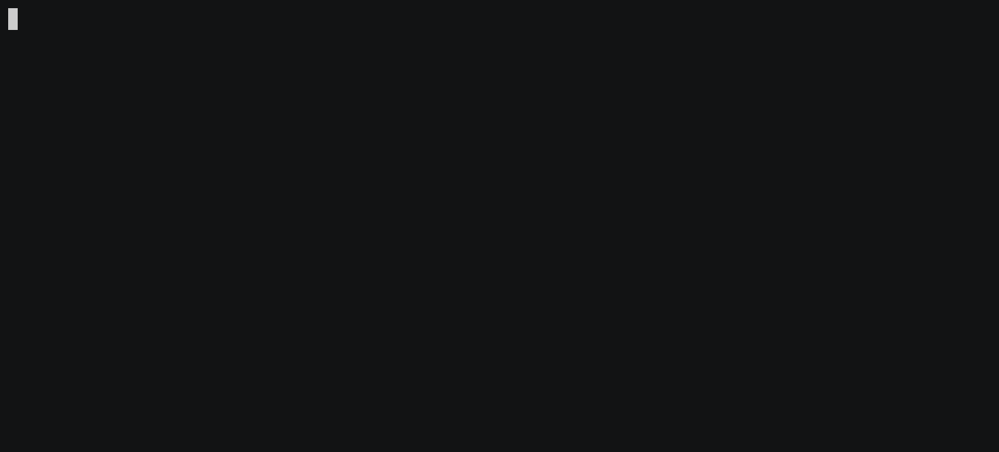

# note.sh

A simple shell script for managing your random daily notes. Every time you
run `note.sh` it opens a Markdown file for that day. For example, if today was
Dec 2, 2020, it would create a Markdown file called `2020-12-02.md` in your
notes directory.

This script was heavily inspired by [todo.txt-cli](https://github.com/todotxt/todo.txt-cli).



## Features

- Simple: 1 Bash script, 1 environment variable and 1 symlink.
- Markdown.
- Search notes.
- Sync notes across multiple computers.

## Setup

1. Configure and export `NOTE_DIR` environment variable.
   Add the environment variable `NOTE_DIR` to your shell's RC file:
   ```shell
   export NOTE_DIR=$HOME/Notes
   ```
   To sync across multiple computers, I put my notes directory inside of my
   Dropbox folder: `$HOME/Dropbox/Notes`.

2. Symlink script to your `/usr/local/bin`.
   ```shell
   $ make install
   ```
   To remove the symlink run: `make uninstall`.
